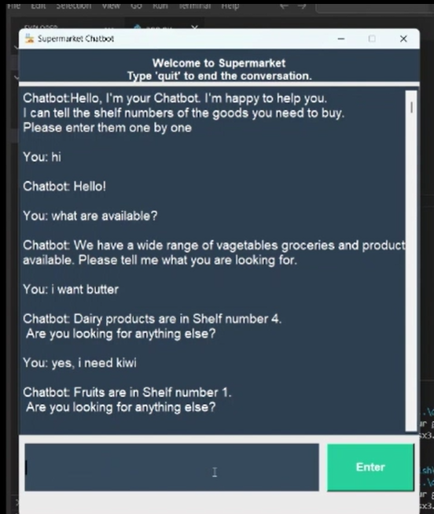

### Chatbot for Product Shelf Location

This project is a simple chatbot application designed to assist users in locating products in a store.
The chatbot responds to user queries related to the location of various items, providing shelf numbers based on pre-defined patterns and intents. 

The purpose of this chatbot is to provide an efficient and user-friendly interface for store customers, enabling them to quickly find the location of items in a store.
By using a chatbot, users can simply ask for a product. Check the demonstration in the NLP chatbot working prototype.zip folder

#### Step-by-Step Guide
Dataset: The chatbot’s responses and patterns are stored in a JSON file (intents.json).
         The JSON file contains various tags, patterns (user queries), and corresponding responses (shelf numbers).

Training: The chatbot is trained using the NLTK library, which is used for tokenization, stemming, lemmatization, and pattern matching. 
The training data is pre-processed and used to build a machine learning model to predict the shelf numbers for user queries.

#### Natural Language Processing (NLP): The chatbot applies NLP techniques, such as:

Tokenization: Breaking down user input into individual words.
Stemming and Lemmatization: Reducing words to their base form to improve matching.
Bag of Words Model: Used to represent user inputs and match them against predefined patterns.
Response Generation: Based on the matched patterns, the chatbot responds with a relevant shelf number where the product is located.

Re-training: If new products or categories need to be added, the JSON file can be updated, and the chatbot model can be retrained with the new dataset.

#### Technologies Used
Python: The programming language used to develop the chatbot.
NLTK: A powerful library for natural language processing that helps in text processing, training, and stemming/lemmatization.
JSON: Used to store intents, patterns, and responses.
Machine Learning: Utilized for matching user inputs to predefined patterns and generating responses.
